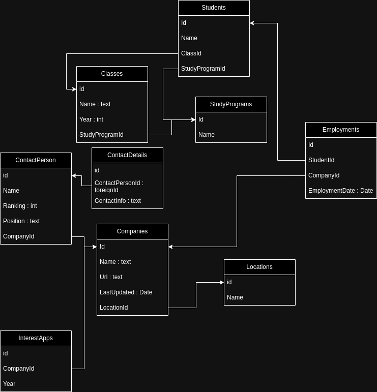

# README: LIA DB PROGRAMMET

## Syfte

Detta projekt syftar till att skapa en databas och ett tillhörande program som liknar funktionaliteten i ett Excel-dokument som används av skolan för att hantera och få en överblick över tillgängliga LIA-platser (Lärande i Arbete). Programmet strukturerar informationen på ett funktionellt och läsbart sätt, vilket gör det möjligt att administrera företag, kontakter, intresseanmälningar och information om studenter. Dessutom inkluderar programmet funktioner för att visa vilka företag som anställt studenter efter en LIA-period, precis som dokumentet gör.

## Teknik

Databas som används är sqlite, ett bra val för utveckling, det är lätt att git clone:a projektet och köra det lokalt. Entity Framework med ett code-first arbetsätt definierar och interagerar med databasen.

### Databas

Databasen innehåller en anmärkningsvärd onormaliserad förbindelse: en student är förbinden inte bara till sin klass, utan även direkt till programmet som klassen i sin tur tillhör. 

